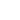

# AIR One Real Estate — Project Documentation

Официальная документация по проекту сайта [airone-group.com](https://airone-group.com/)

---

## Содержание

1. [Структура проекта](#структура-проекта)
2. [Структура ассетов](#структура-ассетов)
3. [Добавление нового сотрудника (страница Our Team)](#добавление-нового-сотрудника)
4. [Добавление нового застройщика (Partners)](#добавление-нового-застройщика)
5. [Добавление новой Сommunity](#добавление-новой-community)
6. [Чеклист изменений — где подключать новые элементы](#чеклист-подключения)

---

## Структура проекта

```
/
├── index.html                  # Главная страница
├── team.html                   # Страница команды (Our Team)
├── partners.html               # Страница всех застройщиков (сетка логотипов)
├── documents.html              # Страница документов
├── contacts.html               # Страница контактов
├── communities.html            # Каталог жилых комплексов / сообществ
│
├── partners/                   # Отдельные страницы застройщиков
│   ├── emaar.html
│   ├── beyond.html
│   ├── imtiaz.html
│   ├── damac.html
│   ├── ellington.html
│   ├── binghatti.html
│   ├── danube.html
│   ├── aldar.html
│   ├── meraas.html
│   ├── nakheel.html
│   ├── sobha.html
│   └── btp.html
│
├── communities/                # Отдельные страницы жилых комплексов
│   ├── DamacIslands2.html
│   ├── EmaarTheValley.html
│   ├── OhanabyJacob&Co.html
│   ├── DamacLagoons.html
│   ├── BinghattiAmberhallVillas.html
│   ├── NadAlShebaGardens.html
│   └── ShaResidencesEmirates.html
│
└── assets/                     # Все медиафайлы и стили (см. раздел ниже)
```

---

## Структура ассетов

```
assets/
├── css/                        # Стили проекта
│   └── style.css               # Основной файл стилей
│
├── js/                         # Скрипты проекта
│   └── main.js                 # Основной JS-файл
│
└── img/
    ├── logo.svg                # Основной логотип (тёмный, в шапке)
    ├── logo-transparent.svg    # Прозрачный логотип (в футере)
    │
    ├── banners/                # Баннеры страниц (hero-изображения)
    │   ├── banner-mobile.webp  # Баннер главной страницы
    │   └── partners-mobile.webp # Баннер страниц Partners и каждого партнёра
    │
    ├── about/                  # Иконки блока "About Company" на главной
    │   ├── 1.svg
    │   ├── 2.svg
    │   └── 3.svg
    │
    ├── icons/                  # Общие иконки интерфейса
    │   ├── burger.svg          # Иконка мобильного меню
    │   ├── tower.svg           # Иконка застройщика (на странице community)
    │   ├── map.svg             # Иконка локации
    │   ├── house.svg           # Иконка типа жилья
    │   ├── clock.svg           # Иконка сроков сдачи
    │   │
    │   ├── partners/           # Иконки преимуществ на страницах застройщиков
    │   │   ├── 1.svg
    │   │   ├── 2.svg
    │   │   ├── 3.svg
    │   │   ├── 4.svg
    │   │   └── 5.svg
    │   │
    │   └── amenities/          # Иконки инфраструктуры/удобств на страницах communities
    │       ├── 1.svg           # Lagoons / Pools
    │       ├── 2.svg           # Promenades / Paths
    │       ├── 3.svg           # Sports areas
    │       ├── 4.svg           # Club spaces
    │       ├── 5.svg           # Restaurants / Parks
    │       └── 6.svg           # Playgrounds
    │
    ├── team/
    │   └── mobile/             # Фотографии сотрудников (PNG, обрезка под мобайл)
    │       ├── Maxim Anischenko.png
    │       ├── Ekaterina Buniaeva Broker.png
    │       └── ...
    │
    ├── partners/               # Ассеты для каждого застройщика
    │   ├── emaar/
    │   │   ├── logo.svg                        # Логотип застройщика
    │   │   ├── landmark/                       # Знаковые проекты (webp)
    │   │   │   ├── BurjKhalifa.webp
    │   │   │   ├── DubaiMall.webp
    │   │   │   ├── DubaiMarina.webp
    │   │   │   └── DowntownDubai.webp
    │   │   └── consider/                       # Проекты к рассмотрению (webp)
    │   │       ├── EmaarBeachfrontResidences.webp
    │   │       ├── DubaiHillsEstateVillasandTownhouses.webp
    │   │       └── MarinaVistaApartments.webp
    │   ├── beyond/
    │   │   └── logo.svg
    │   ├── damac/
    │   │   └── logo.svg
    │   └── ...                 # Остальные застройщики по той же схеме
    │
    ├── communities/            # Превью-изображения для страницы communities.html
    │   ├── DamacIslands2.webp
    │   ├── EmaarTheValley.webp
    │   ├── OhanabyJacob&Co.webp
    │   ├── DamacLagoons.webp
    │   ├── BinghattiAmberhallVillas.webp
    │   ├── NadAlShebaGardens.webp
    │   └── ShaResidencesEmirates.webp
    │
    └── socials/                # Иконки соцсетей в футере
        ├── tg.svg
        ├── yt.svg
        └── linkedin.svg
```

> **Формат изображений:**
> - Фотографии сотрудников — `.png` (папка `team/mobile/`)
> - Логотипы застройщиков — `.svg`
> - Баннеры, фото проектов и communities — `.webp` (оптимальный вес)
> - Иконки интерфейса — `.svg`

---

## Добавление нового сотрудника

Сотрудники отображаются на двух страницах: `team.html` (полный список) и `index.html` (блок "Top Brokers").

### Шаг 1 — Подготовить фото

Положить фото в папку:
```
assets/img/team/mobile/Имя Фамилия Должность.png
```
Пример: `assets/img/team/mobile/Ivan Petrov Broker.png`

Требования к фото:
- Формат: `.png`
- Обрезка: портрет, преимущественно на светлом/нейтральном фоне
- Наименование файла: `Имя Фамилия Должность.png` — точно так же, как указано в `src` атрибуте

### Шаг 2 — Добавить в `team.html`

Открыть `team.html` и добавить блок в нужный раздел (`Active Brokers`, `Sales Department` или `Management`):

```html
<!-- Пример для нового брокера -->
<div class="team-card">
  
  <h5>Ivan Petrov</h5>
  <p>Real Estate Broker</p>
</div>
```

Разделы в `team.html`:
- **Sales Department** — руководитель отдела продаж
- **Active Brokers** — действующие брокеры
- **Founders & Management** — основатели и менеджмент

### Шаг 3 — Добавить в `index.html` (блок "Top Brokers", опционально)

Если сотрудник должен отображаться на главной в блоке "Top Brokers", добавить аналогичный блок в `index.html` в секцию `### Our Team / Top Brokers`:

```html
<div class="team-card">
  
  <h5>Ivan Petrov</h5>
  <p>Real Estate Broker</p>
</div>
```

> На главной обычно отображается только 4 брокера. При добавлении нового нужно решить — убрать одного из существующих или расширить сетку.

---

## Добавление нового застройщика

Застройщик (developer/partner) присутствует в нескольких местах проекта. Ниже — полный чеклист.

### Шаг 1 — Подготовить ассеты

Создать папку застройщика:
```
assets/img/partners/newdeveloper/
├── logo.svg                    # Логотип застройщика (SVG, желательно горизонтальный)
├── landmark/
│   ├── ProjectName1.webp       # Знаковые проекты (3–4 штуки)
│   ├── ProjectName2.webp
│   └── ProjectName3.webp
└── consider/
    ├── ProjectForSale1.webp    # Актуальные проекты для клиентов (2–3 штуки)
    └── ProjectForSale2.webp
```

> Имя папки — строчными латинскими буквами без пробелов: `emaar`, `damac`, `newdeveloper`.

### Шаг 2 — Создать страницу застройщика

Создать файл `partners/newdeveloper.html`, скопировав структуру любого существующего файла (например, `partners/emaar.html`) и заменив:
- Заголовок `<title>` и `<meta>` описание
- Логотип: `src="assets/img/partners/newdeveloper/logo.svg"`
- Текстовое описание застройщика
- Блок **Landmark Projects** — 3–4 знаковых объекта с фото и подписями
- Блок **Why Buyers Choose** — 4 преимущества (используются иконки `assets/img/partners/icons/1-4.svg`)
- Блок **Key Facts** — год основания, штаб-квартира, сегмент, локации
- Блок **Projects to Consider Now** — 2–3 актуальных проекта

Пример блока Landmark Project:
```html
<div class="landmark-card">
  
  <h6>Project Name</h6>
  <p>Краткое описание проекта.</p>
</div>
```

### Шаг 3 — Добавить логотип в `partners.html`

Открыть `partners.html`, найти секцию `### Our Key Partners` и добавить новый логотип в сетку:

```html
<a href="partners/newdeveloper.html">
  
</a>
```

### Шаг 4 — Добавить логотип на главную страницу `index.html`

Открыть `index.html`, найти секцию `### Partners` (сетка логотипов на главной) и добавить аналогичный тег:

```html
<a href="partners/newdeveloper.html">
  
</a>
```

> Именно здесь логотип появляется в сетке застройщиков на главной странице.

### Итоговый чеклист для нового застройщика

| Действие | Файл |
|---|---|
| Создать папку с ассетами | `assets/img/partners/newdeveloper/` |
| Добавить логотип | `assets/img/partners/newdeveloper/logo.svg` |
| Добавить фото landmark-проектов | `assets/img/partners/newdeveloper/landmark/*.webp` |
| Добавить фото проектов consider | `assets/img/partners/newdeveloper/consider/*.webp` |
| Создать страницу застройщика | `partners/newdeveloper.html` |
| Добавить в сетку на **главной** | `index.html` → секция Partners |
| Добавить в сетку на **странице Partners** | `partners.html` → секция Our Key Partners |

---

## Добавление новой community

Community — это страница конкретного жилого комплекса или проекта. Они отображаются в каталоге `communities.html` и имеют отдельные страницы в папке `communities/`.

### Шаг 1 — Подготовить изображения

```
assets/img/communities/
├── NewProject.webp             # Превью для каталога communities.html (карточка)
└── 2-NewProject.webp           # Большое изображение для hero-баннера внутри страницы
```

> Соглашение по именованию: префикс `2-` используется для hero-баннера внутри страницы community. Само превью (без префикса) идёт в каталог.

### Шаг 2 — Создать страницу community

Создать файл `communities/NewProject.html`, скопировав структуру существующей страницы (например, `communities/DamacIslands2.html`) и заменив:

- `<title>` и мета-описание
- Hero-изображение: `src="assets/img/communities/2-NewProject.webp"`
- Заголовок `<h1>` — название проекта
- Статус: `Off-plan` / `Ready` / `Under construction`
- Застройщик (иконка `tower.svg`), локация (`map.svg`), тип жилья (`house.svg`), срок сдачи (`clock.svg`)
- Описание проекта
- Блок **Key Features** — характеристики (иконки `assets/img/icons/partners/1-5.svg`)
- Блок **Payment Plan** — план оплаты в процентах
- Блок **Amenities** — инфраструктура (иконки `assets/img/icons/amenities/1-6.svg`)

Пример шапки страницы community:
```html


<h1>New Project Name</h1>
<span>Status: Off-plan</span>

 Developer Name
 District Name
 Villas / Apartments
 Handover: Q4 2027
```

### Шаг 3 — Добавить карточку в `communities.html`

Открыть `communities.html` и добавить новую карточку в список. Карточки чередуются по расположению (изображение слева/справа) — следить за паттерном:

```html
<!-- Карточка с изображением справа -->
<div class="community-card">
  <div class="community-info">
    <h3>New Project Name</h3>
    <p>Краткое описание проекта — 2-3 предложения.</p>
    <a href="communities/NewProject.html">Show More</a>
  </div>
  
</div>

<!-- Карточка с изображением слева -->
<div class="community-card community-card--reversed">
  
  <div class="community-info">
    <h3>New Project Name</h3>
    <p>Краткое описание проекта — 2-3 предложения.</p>
    <a href="communities/NewProject.html">Show More</a>
  </div>
</div>
```

### Итоговый чеклист для новой community

| Действие | Файл |
|---|---|
| Добавить превью-изображение | `assets/img/communities/NewProject.webp` |
| Добавить hero-изображение | `assets/img/communities/2-NewProject.webp` |
| Создать страницу community | `communities/NewProject.html` |
| Добавить карточку в каталог | `communities.html` |

---

## Чеклист подключения

Сводная таблица — **где именно** нужно прописывать новые элементы, чтобы они появились везде на сайте:

| Элемент | index.html | partners.html | team.html | communities.html | Папка partners/ | Папка communities/ |
|---|:---:|:---:|:---:|:---:|:---:|:---:|
| Новый застройщик | ✅ Сетка Partners | ✅ Сетка Our Key Partners | — | — | ✅ Новый HTML-файл | — |
| Новый сотрудник (Top Broker) | ✅ Блок Our Team | — | ✅ Раздел Active Brokers | — | — | — |
| Новый сотрудник (остальные) | — | — | ✅ Нужный раздел | — | — | — |
| Новая community | — | — | — | ✅ Карточка в список | — | ✅ Новый HTML-файл |

---

## Примечания

- Все пути к файлам указываются **относительно корня проекта** (без ведущего `/`).
- Изображения желательно сохранять в формате `.webp` — меньший вес при хорошем качестве.
- При добавлении нового застройщика счётчик `15+ Verified Developer Partners` на главной (`index.html`) нужно обновить вручную.
- Навигация (`<nav>`) одинакова на всех страницах — при добавлении нового раздела менять её в **каждом** HTML-файле проекта.